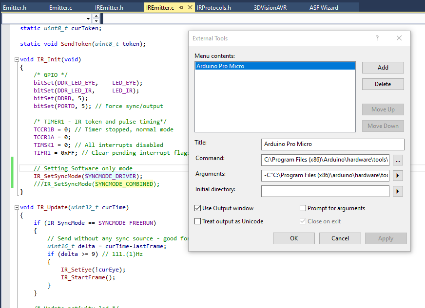
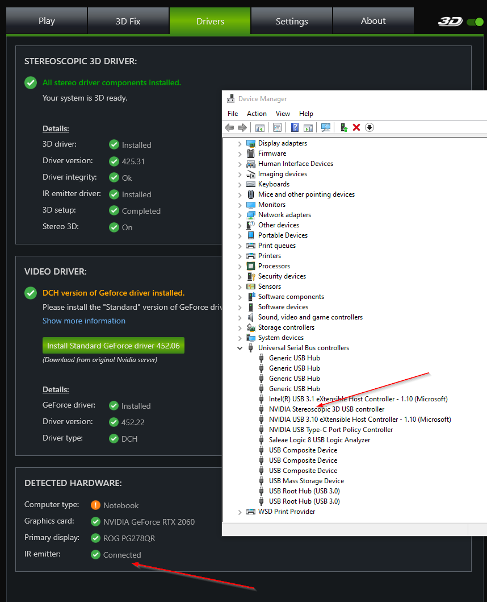

# 3DVisionAVR Firmware
Flashing the Arduino Pro Micro with the [3DVisionAVR](https://github.com/lukis101/3DVisionAVR) code does require a few tools and steps. In order to help others with that process, here is what worked for me on Windows 10.

Download and install [Arduino IDE](https://www.arduino.cc/en/software) and [Microchip Studio](https://www.microchip.com/en-us/tools-resources/develop/microchip-studio#Downloads) for AVR (at the time, my versions were Arduino 1.8.10 and Studio v7.0.2542). 

Download lukis101's code from Github and make sure to include the lufa submodule. I recommend using git command for this:

    git clone --recurse-submodules https://github.com/lukis101/3DVisionAVR.git

Next open the [3DvisionAVR.atsln](https://github.com/lukis101/3DVisionAVR/blob/master/3DVisionAVR.atsln) file in Microchip Studio. I made one change since I'm doing the software only driver. Open the [IREmitter.c](https://github.com/lukis101/3DVisionAVR/blob/master/3DVisionAVR/IREmitter.c#L40) file and change 

**IR_SetSyncMode(SYNCMODE_COMBINED);**

over to the software only driver mode

**IR_SetSyncMode(SYNCMODE_DRIVER);**

Save the file, then go under the BUILD menu to BUILD SOLUTION. Read the output window and make sure you got a "Build succeeded" message. At this point, you have the compiled code, but we need to flash that to the Pro Micro.

# Flashing

You will need to manually set the COM port of the Pro Micro to flash it. Here's one way to get that. Plug in the Pro Micro. Open the Window's DEVICE MANAGER _(devmgmt.msc)_ and expand the PORTS section. You should see a COM port for the Pro Micro, however, we need the bootloader COM port. This is typically one number higher than the default one you'll see. So if it says "COM8", you can assume the bootloader we want is at "COM9". To test this, quickly double tap the RESET button on the Pro Micro (if your Pro Micro does not have a reset button, you [achieve the same thing](https://learn.sparkfun.com/tutorials/pro-micro--fio-v3-hookup-guide/troubleshooting-and-faq) by shorting the RESET Pin to GND twice quickly). This will enter the bootloader mode for 7 seconds and the correct com port will quickly be listed in device manager. If you double tap at the wrong speed, the device just resets instead of entering the bootloader mode, so it may take a few tries.

We are flashing the code via Microchip Studio, but it uses the Arduino tools for the process. If you've installed Arduino IDE into a different directory, you will need to change these file paths to match yours. In Microchip Studio go under TOOLS to the EXTERNAL TOOLS option. Add a new entry:

    Title: Arduino Pro Micro
    
    Command: C:\Program Files (x86)\Arduino\hardware\tools\avr\bin\avrdude.exe
    
    Arguments: -C"C:\Program Files (x86)\arduino\hardware\tools\avr\etc\avrdude.conf" -v -patmega32u4 -cavr109 -PCOM9 -b57600 -D -Uflash:w:"$(ProjectDir)\3DVisionAVR.hex":i

Check the "Use Output window" option then Apply the changes. You will need to change the **-PCOM9** in the Arguments to match your bootloader com port as mentioned above.

Make sure you have a compiled build (BUILD menu to BUILD SOLUTION) and your Pro Micro is plugged in over USB. You will need to quickly double tap the RESET button on the Pro Micro, then in Microchip Studio select under the TOOLS menu the new "Arduino Pro Micro" command. If you do this at the wrong speed, you'll either get an error message about the com port not being found or sometimes sync errors. This is tricky and took me about 5 tries until I got it the first time. Always read the output window.

If everything worked correctly, Device Manager will now have under "Universal Serial Bus controllers" a new "NVIDIA Stereoscopic 3d USB controller" and 3D Manager will show an IR emitter as Connected.

Now launch your game via 3D Fix Manager like normal. 
