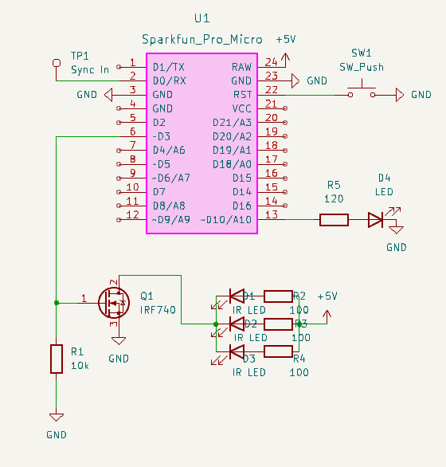
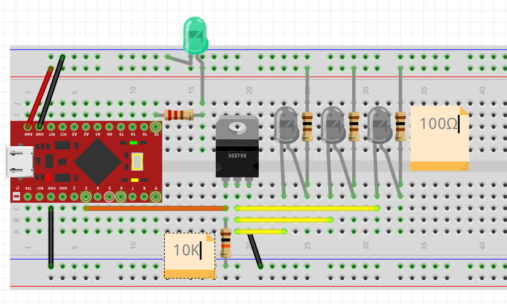
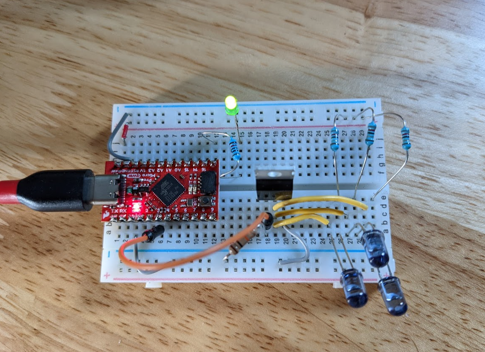
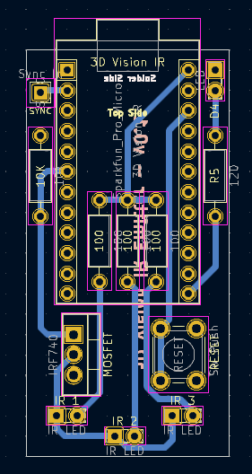
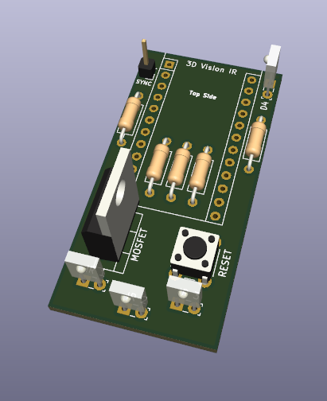

# 3DVisionAVR-Hardware
Hardware design files and info for 3DVisionAVR, a clone for 3D Vision Emitter using IR. This is a hardware implementation to use with Lukis101's [3DVisionAVR](https://github.com/lukis101/3DVisionAVR) code

# Notice
This is at an early stage and may change significantly. It should not be considered a replacement for the official 3D Vision Emitter pyramid. You will likely notice limited range of the IR signal and sync issues. Consider this a work in progress which you can help test and improve

# Design Files
This was designed in Kicad v6 and uses [g200kg's kicad-lib-arduino](https://github.com/g200kg/kicad-lib-arduino) library for the Sparkfun Pro Micro

The main component is an Arduino Pro Micro. This should work fine with a clone version to save a few dollars. However, to make things easy, all items can be purchased via the [Sparkfun Wishlist 167547](https://www.sparkfun.com/wish_lists/167547) for around $50 USD. 

# Breadboarding
The circuit is easy to create on a breadboard.

- Pro Micro PIN 3 is our IR Signal (goes to mosfet Gate)
- Pro Micro PIN 10 is USB Status light (goes to resistor to green led)
- Pro Micro RAW is IR LED Power (goes to positive rail)

Hook up GND on both sides of the Pro Micro to the negative rail. The mosfet source pin goes to GND and the middle drain pin goes to the cathode pin of the IR leds (short leg). Wire Pin 3 from the Pro Micro to the gate on the mosfet and then a pull down 10K resistor (connected to the negative rail). Each IR Led should have the anode (long leg) connected via a 100 ohm resistor to the RAW positive rail. Finally hook up the status LED to the signal on Pin 10 (it might be unlabeled but next to pin 16). 

Also if you are using the VESA sync, that goes into the Pro Micro PIN 2. Point the IR LEDs at your face for best results :-)

# PCB
I'm currently having this PCB fabricated, but all files are here if you would also like to fab your own. This is using common through-hole parts so it can be packaged into an easy to assemble kit.

# Flashing
For steps on compiling and flashing Lukis101's [3DVisionAVR](https://github.com/lukis101/3DVisionAVR) code for this project, view [README-FLASH-FIRMWARE.md](README-FLASH-FIRMWARE.md)